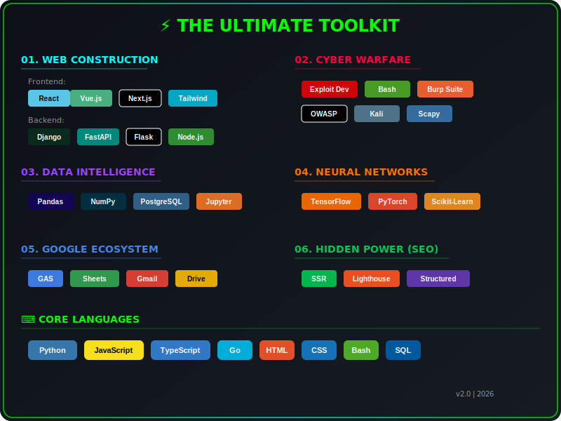

<!-- Language Navigation -->
<div align="right">
  <a href="README.md" title="English">
    
  </a>
  <a href="README_ID.md" title="Bahasa Indonesia">
    
  </a>
</div>

<div align="center">
  
  <!-- Identity Core -->
  

  <h1 style="font-size: 2.5em; margin-bottom: 0;">Hedwig Adityas. <small style="font-size: 0.5em; color: #8b949e;">A.Md.Kom</small></h1>
  <h3 style="color: #6e7681; margin-top: 0;">Computerized Accounting</h3>

  <!-- Dynamic Typing Effect -->
  <a href="https://git.io/typing-svg">
    
  </a>

  <!-- Social & Security Badges -->
  <p>
    <a href="https://github.com/callmeredzi">
      
    </a>
    <a href="https://github.com/callmeredzi">
      
    </a>
    <a href="https://github.com/callmeredzi">
      
    </a>
  </p>

</div>

---

<!-- Professional Introduction -->
<h3 align="center">
  <i>"I engineer secure, intelligent, and autonomous digital ecosystems."</i>
</h3>

<br />

<!-- The Pentagon of Power: Technical Arsenal -->
## ⚡ The Technical Arsenal

<div align="center">

<!-- Tech Stack Visualization -->


</div>

<details>
<summary>📋 <b>Detailed Badge View</b></summary>
<br/>

<div align="center">

<!-- Pillar 1: Web Development -->
### 1. Web Architecture (Full Spectrum)
<p>
  <!-- Backend -->
  
  
  
  
</p>
<p>
  <!-- Frontend -->
  
  
  
  
</p>

<!-- Pillar 2: Ethical Hacking -->
### 2. Cyber Warfare & Security
<p>
  
  
  
  
</p>

<!-- Pillar 3: Data Science -->
### 3. Data Intelligence
<p>
  
  
  
  
</p>

<!-- Pillar 4: Machine Learning -->
### 4. Neural Networks & ML
<p>
  
  
  
</p>

<!-- Pillar 5: Google Ecosystem -->
### 5. Workspace Automation
<p>
  
  
</p>

</div>

</details>

---

<!-- Live Telemetry Section -->
## 📊 Live System Metrics

<div align="center">
  
  <!-- GitHub Stats -->
  <a href="https://github.com/callmeredzi">
    
  </a>
  
  <br/>

  <!-- Top Languages -->
  <a href="https://github.com/callmeredzi">
    
  </a>

  <br/>

  <!-- Streak Stats -->
  <a href="https://github.com/callmeredzi">
    
  </a>

</div>

<!-- Activity Graph -->
## 📈 Activity Graph
<div align="center">
  <a href="https://github.com/callmeredzi">
    
  </a>
</div>

<!-- Animated Contribution Graph -->
## 🐍 Neural Training Progress
<div align="center">
  <picture>
    <source media="(prefers-color-scheme: dark)" srcset="https://raw.githubusercontent.com/callmeredzi/callmeredzi/output/github-contribution-grid-snake-dark.svg" />
    <source media="(prefers-color-scheme: light)" srcset="https://raw.githubusercontent.com/callmeredzi/callmeredzi/output/github-contribution-grid-snake.svg" />
    
  </picture>
</div>

> ⚠️ *Run `Generate Snake Animation` workflow manually in Actions tab to generate*

---

<!-- Knowledge Stream (Blog) -->
## ✍️ Knowledge Stream
<!-- BLOG-POST-LIST:START -->
<!-- BLOG-POST-LIST:END -->

---

<!-- WakaTime Stats -->
## ⏱️ Weekly Development Breakdown
<!--START_SECTION:waka-->
```text
⌛ Waiting for WakaTime data...
   Configure WAKATIME_API_KEY secret to enable
```
<!--END_SECTION:waka-->

---

<!-- High-Priority Repositories -->
## 📌 Critical Systems
<div align="center">
  <a href="https://github.com/callmeredzi/callmeredzi">
    
  </a>
</div>

---

<!-- Security & Hardware Intel -->
<div align="center">
  
  
  
</div>

---

<!-- Certifications -->
## 🏆 Certifications
<div align="center">
  
  
</div>

---

<!-- Footer & Credentials -->
<div align="center">
  
  
  
  <br/>
  <br/>
  
  <!-- "Buy Me A Coffee" Placeholder -->
  <a href="https://www.buymeacoffee.com/callmeredzi">
    
  </a>
  
  <p style="margin-top: 20px; font-size: 0.8em; color: #8b949e;">
    &copy; 2026 Hedwig Adityas | Advanced System Architecture
  </p>
</div>
